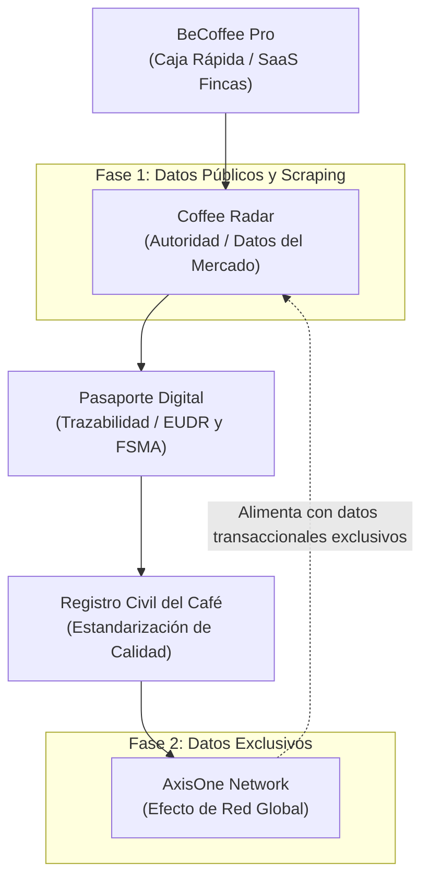

# Coffee Radar: El Bloomberg del Café de Especialidad
## Estrategia de Producto Modular e Inteligencia de Datos (v1.1)

Este documento detalla la estrategia para conceptualizar, construir y vender **Coffee Radar** de forma 100% independiente de AxisOne. Coffee Radar no requiere usuarios iniciales en AxisOne; se alimenta de datos públicos, señales de búsqueda y scraping legal para entregar inteligencia comercial premium a exportadores, importadores y tostadores.

---

## 1. Concepto Visual de la Interfaz

La siguiente propuesta visual ilustra cómo se estructuraría el terminal de Coffee Radar enfocado en datos de mercado, tendencias agregadas y directorio activo:

---

## 2. El Cambio de Paradigma: Del Cold-Start al Valor Inmediato

Tradicionalmente, un sistema de inteligencia de red sufre del problema de "arranque en frío" (cold-start): no tiene valor hasta que tiene miles de usuarios generando datos. 

Al cambiar el modelo, Coffee Radar se redefine:
*   **Enfoque anterior (Pasivo):** Un dashboard interno para clientes de AxisOne.
*   **Enfoque nuevo (Activo):** Un agregador de inteligencia de mercado externo. Resuelve la dispersión de información en la industria.

> [!NOTE]
> **Tesis Comercial:** No vendemos "software" o "inteligencia artificial". Vendemos: **"Descubra oportunidades comerciales antes que su competencia"**.

---

## 3. Fuentes de Información para el MVP (Sin AxisOne)

Para lanzar Coffee Radar sin información técnica de AxisOne, el sistema se alimentará de cuatro pilares de datos externos:

### A. Información Pública y Macroeconómica
*   **Precios de Referencia:** Precio C de la Bolsa de Nueva York (ICE) y diferenciales físicos por origen (ej. diferencial de Colombia, Honduras, etc.).
*   **Volúmenes de Comercio:** Reportes mensuales de la ICO (Organización Internacional del Café), exportaciones de la Federación de Cafeteros, importaciones del USDA.
*   **Licitaciones y Subastas:** Resultados de subastas de café de especialidad (Cup of Excellence, subastas privadas de importadores).

### B. Scraping Legal de Tostadores y Marketplaces
Monitorear las páginas web de los 200 tostadores de especialidad más influyentes en mercados de consumo (EE.UU., Alemania, Reino Unido, Japón, etc.) y marketplaces (ej. Cropster Hub, Algrano):
*   **Qué extraer:** Países de origen ofrecidos, procesos (lavados, naturales, honey, anaeróbicos, co-fermentados), variedades (Gesha, Castillo, Pink Bourbon) y precios de venta retail.
*   **Inteligencia generada:** *"El 64% de los tostadores medianos en Alemania ahora ofrecen al menos un café anaeróbico, frente al 40% de hace seis meses. El precio promedio por bolsa de 250g subió un 12%."*

### C. Señales de Búsqueda y Tendencias (Search Intent)
*   **Interés de Búsqueda:** Consultas en buscadores y redes de nicho (Reddit r/coffee, Instagram, Google Trends) sobre variedades y procesos.
*   **Inteligencia generada:** *"Las búsquedas de 'Pink Bourbon' crecieron un 45% interanual en el Reino Unido."* Esto es oro para un exportador decidiendo qué variedades promover con sus caficultores.

### D. Directorio Vivo de Compradores
*   **Rastreo de Perfiles Públicos:** Mapear qué tostadores e importadores compran qué tipo de café.
*   **Inteligencia generada:** Un directorio que no vende datos privados, sino perfiles de compra: *"Tostador X en Hamburgo compra un 80% de cafés lavados de América Central y un 20% de experimentales de Colombia."*

---

## 4. Producto Inicial: Coffee Radar Weekly & Dashboard Simple

Para validar la disposición de pago rápidamente, no se necesita una plataforma hiper-compleja. Se proponen dos formatos de entrega:

### Opción 1: El Boletín Premium (Coffee Radar Weekly)
*   **Formato:** Un reporte en PDF o newsletter premium (Substack/Ghost) enviado todos los lunes.
*   **Precio:** USD 29 - 49 / mes.
*   **Contenido:**
    *   **Procesos en tendencia:** Qué procesos están ganando espacio en los menús de tostadores internacionales.
    *   **Orígenes calientes:** Países que están ganando cuota de mercado en la oferta de especialidad.
    *   **Nuevos compradores:** Directorio de 5-10 tostadores medianos/grandes que acaban de actualizar su oferta o buscar nuevos orígenes.
    *   **Alertas de precios:** Resumen analítico de diferenciales de origen vs. bolsa de Nueva York.

### Opción 2: El Dashboard Minimalista (Radar UI)
*   Una interfaz simple con 3 pestañas principales:
    1.  **Trend Tracker:** Gráficos sencillos de procesos y variedades en tendencia (scraped data).
    2.  **Buyer Directory:** Base de datos filtrable de tostadores activos por país y tipo de café preferido.
    3.  **Market Feed:** Agregador de reportes de tostadores, reportes de importadores y licitaciones activas.

---

## 5. La Secuencia del Volante (Flywheel Ecosistémico)

El orden lógico modular que propone convierte a cada pieza en un negocio independiente que financia y alimenta al siguiente:

### Detalle de la Secuencia:

1.  **BeCoffee Pro (Caja Rápida):** Resuelve el dolor diario de administración y control de costos para productores y cooperativas. Genera suscripciones SaaS estables y tracción local en origen.
2.  **Coffee Radar (Autoridad):** Posiciona a la marca como la autoridad analítica del café de especialidad a nivel global. Atrae la atención de importadores y tostadores internacionales (compradores) que buscan tendencias y proveedores fiables.
3.  **Pasaporte Digital (Trazabilidad):** Aprovecha la regulación internacional (EUDR/FSMA) para cobrar un fee transaccional ($300 USD por contenedor o certificado). Conecta los datos de producción física con la aduana.
4.  **Registro Civil del Café (Estandarización):** Crea una hoja de identidad digital única por lote (análisis físico, SCA, Agtron, perfil sensorial) inmutable.
5.  **AxisOne Network (Efecto Red):** Une a BeCoffee Pro, el Pasaporte y el Registro Civil en una red transaccional. En esta fase, **Coffee Radar pasa a Fase 2**: ya no solo reporta lo que raspa de internet, sino que ofrece *insights exclusivos* (anonimizados y agregados) sobre flujos reales de café de especialidad en el mundo. El activo final es la red de datos exclusivas, convirtiéndose en el verdadero foso defensivo (moat) del negocio.
